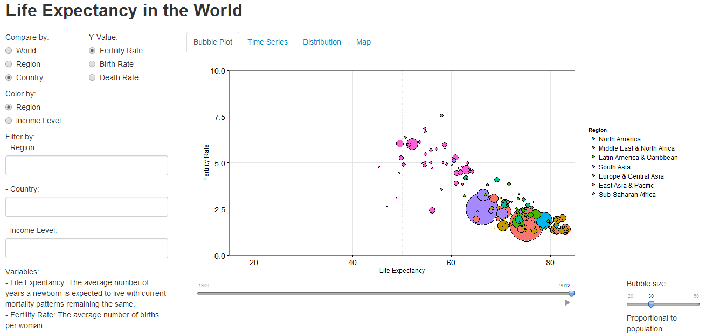
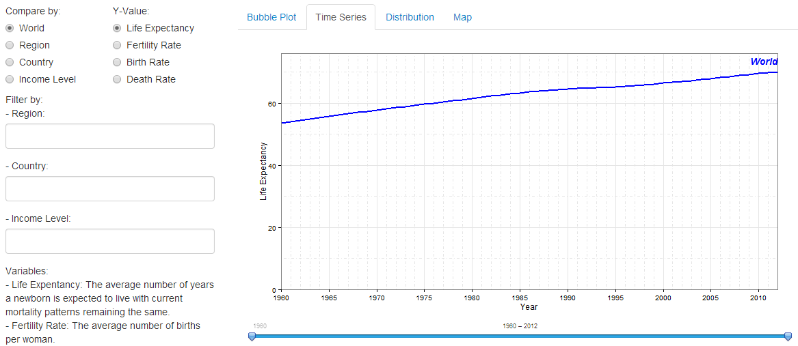
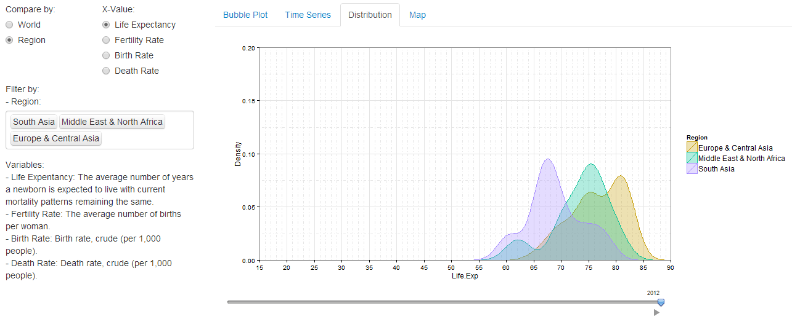
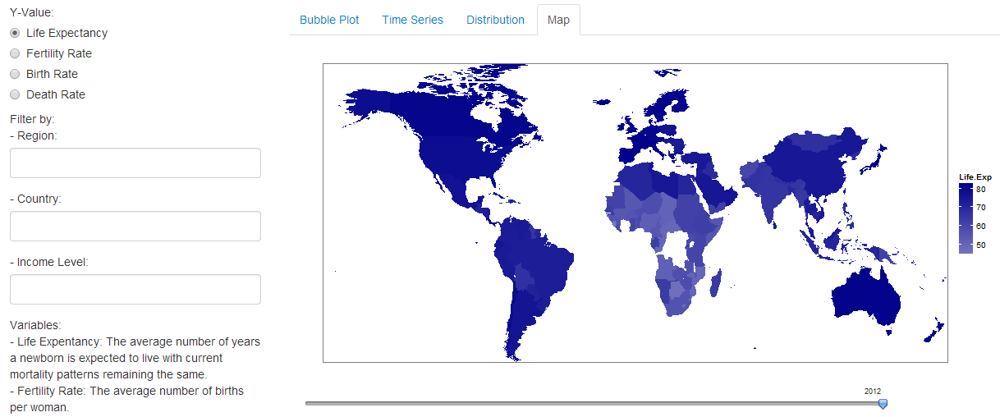

Final Project
==============================

| **Name**  | Dora (Weiran) Wang  |
|----------:|:-------------|
| **Email** | wwang48@dons.usfca.edu |

## Instructions ##

The following packages must be installed prior to running this code:

- `ggplot2`
- `shiny`
- `scales`
- `grid`

Use the following code to run this shiny app:

To run this code, please enter the following commands in R:

```
library(shiny)
shiny::runGitHub('msan622', 'doraw880', subdir='final-project')
```

## Discussion ##

### Tech 1. Bubble Plot ###



I preprocessed the data based on the choice in the "Compare by". If user chooses "World", I took the average of both the X variable and Y variable for all the data in one year. If user chooses "Region", I took the average of both the X variable and Y variable for each region in one year. If user chooses "Country", I keep the original data as it is at a country level. Also, I added a color column to the data and assigned the colors based on the choice in the "Color by". If user wants to filter the data, I assigned the filtered out data "white" color. In this way, I could use `scale_fill_manual(values = levels(df$color)` to give the bubbles colors.

I removed the color of background to increase the data-ink ratio. I made the default bubble size as 30 to keep the data density at a good level.

The bubble plot could give a picture of the relationship between two variables. And we could see how it changed over time by looking at the moving track if user clicks the "play" button. We can see that the Fertility Rate and Life Expectancy shows a negative correlation, and Fertility Rate decreases while Life Expectancy increase over time, which means people live longer with fewer children.

#### Interactivity ####
- Users can choose which level to compare. This will help users to see a different level data.
- Users can choose by which variable the plot is colored.
- Users can choose which Y-value to view.
- Users can filter Region, Country and Income Level to view. This will help users to focus on two or three regions, countries or income levels to compare.
- Users can choose which year to view and they also can click "play" button to see how bubbles move over time.
- Users can choose the bubble size.

### Tech 2. Time Series Plot ###



Similarly, I preprocessed the data based on the choice in the "Compare by" and added a color column and assigned the colors based on the same choice. If user wants to filter the data, I assigned the filtered out data "white" color.

I removed the color of background to increase the data-ink ratio. When user chooses "Country" to compare, I controlled the maximum number of countries to be less than 8 to keep the data density at a good level. The lie factor of this plot is 1 as ylim is alway from 0.

The time series could help compare trends between regions or countries. We could see that the world life expectancy increases over time and life expectancy for most countries and regions increase as well.

#### Interactivity ####
- Users can choose which level to compare. This will help users to see a different level data.
- Users can choose which Y-value to view.
- Users can filter Region, Country and Income Level to view. This will help users to focus on two or three regions, countries or income levels to compare.
- Users can choose the years range. This will help users to focus on the trends in particular years.

### Tech 3. Density Plot ###



I preprocessed the data based on the choice in the "Compare by". If user chooses "World", I used all the data to create the density plot. If user chooses "Region", I filtered the data by regions which user chooses and grouped the data by regions when I create the density plot.

I removed the color of background to increase the data-ink ratio. When user chooses "Region" to compare, I controlled the maximum number of regions to be less than 3 to keep the data density at a good level.

The density plot could help compare distributions over time. For example, if we select region "East Asia & Pacific" and click "play" button, we could see that the area of the density plot is moving from the left to the right, which means the values of life expectancy of most countries in this region increases over time. We could also see that the area becomes narrower over time, which means the values of life expectancy becomes closer between countries in this region.

#### Interactivity ####
- Users can choose which level to compare. This will help users to see a different level data.
- Users can choose which X-value to view.
- Users can filter Region. This will help users to focus on two or three regions to compare.
- Users can choose which year to view and they also can click "play" button to see how the distributions change over time.

### Tech 4. Map Plot ###



I loaded the longitude and latitude data for the world countries by using `countries <- map_data("world")` and mapped this data with my data by "region" column. In this way, I could use `p <- qplot(long, lat, data = df, group = group, fill = Life.Exp, geom = 'polygon')` to plot the data on the map.

I removed the color of background, panels, X and Y labels, texts and ticks to increase the data-ink ratio. The lie factor of this plot is less than 1 as it's hard to know the exact values of data by reading the different color gradients (they look similar even the values are very different).

The map could provide geographic information. We could see that the life expectancy in Africa is relatively lower than other regions at the first glance.

#### Interactivity ####
- Users can choose which Y-value to view.
- Users can filter Region, Country and Income Level to view. This will help users to focus on two or three regions, countries or income levels to compare.

### Prototype Feedback ###

The main feedbacks include two points:
- Add conditional panel since there are some unnecesary interfaces for some of the plots.
- Have life expectancy on the y-axis in the bubble plot as I want to show which variable has relationship with life expectancy.  

I think the first feedback is really helpful. I added conditional panel to control the different interfaces for different plots. I also think the second feedback makes sense to me. I tried to revise the variables in X and Y axis. However, if I put life expectancy in the y axis and fertility rate in the x axis, the bubbles will move left and up over time. Compared with that, I prefer bubbles moving right and down when life expectancy is in the x axis as the year in the slider below is also from left to the right.

### Challenges ###

1. Keep the colors consistent: I want the colors for the first three plots to be consistent, i.e. if "South Asia" in the first bubble plot is purple, it should be purple as well in time series and density plot. I had a hard time adjusting colors for these plots, but I finally found a way to do that: add a color column.

2. Fix the legend area width: My legend is on the right of my plot and its area width is decided by the length of legend text. For example, the length of "South Africa" is less than that of "Latin America & Caribbean", so if I only filter "South Africa", the legend width will be much shorter. This cause the width of my plot area changing all the time once I filter different regions. I searched a lot about how to fix legend size on google but couldn't find a good way so far.

3. Map my data with "world" data in ggplot: Because the country names in my data and world data in ggplot are different, when I merged them together, the data of some countries are lost (which include the data in America). I mannually checked the different country names and changed the names in my data using R code. However, I still miss some of the countries.

If I have more time, I would try to improve the map, maybe using bubbles instead of coloring the whole country areas, since I think this map doesn't provide a lot of information now. 