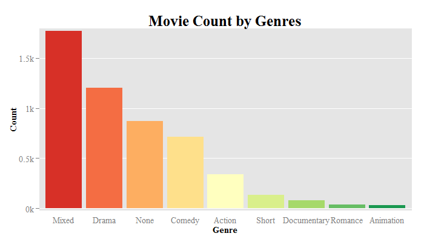
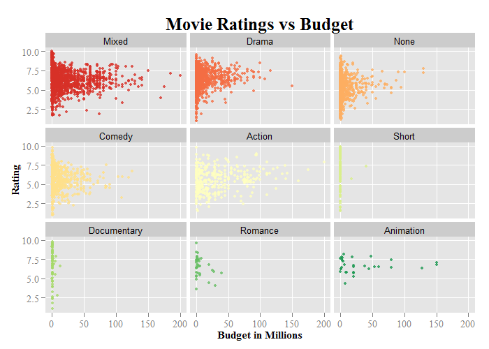
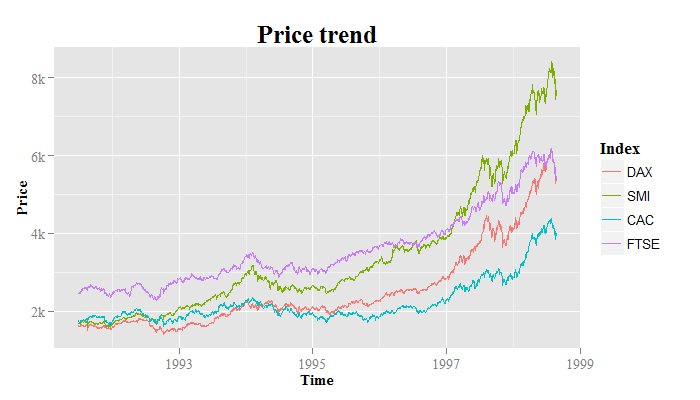

Homework 1: Basic Charts
==============================

| **Name**  | Dora (Weiran) Wang  |
|----------:|:-------------|
| **Email** | wwang48@dons.usfca.edu |

## Instructions ##

The following packages must be installed prior to running this code:

- `ggplot2`
- `gridExtra`

To run this code, please enter the following commands in R:

```
source_url("https://github.com/doraw880/msan622/tree/master/homework1/Basic Charts.R")
```

This will generate 4 images. See below for details.

## Discussion ##

In the first three movie images, movies with the same genre are assigned to the same color, and the colors are gradient with the increase of movie count in one genre. To achieve this, I firstly made a new dataset which only has genre and movie count, reordered it by count, and gave the color rank to each genre. Then, I merged the movies dataset with the color rank.

```R
> print(genre_count)
        genre count color
6       Mixed  1771     1
5       Drama  1201     2
7        None   869     3
3      Comedy   713     4
1      Action   340     5
9       Short   135     6
4 Documentary    82     7
8     Romance    41     8
2   Animation    31     9
```

The color rank column was used as the colors in the images, and `scale_colour_brewer(palette="RdYlGn")` was added to limit the colors into three main colors. Therefore, the genre with more movies has redder color, the genre with less movies has greener color, and the one with median number of movies has yellow color.


For the scatter above, I devided the values of x-axis text by 1000000, and added "(Million Dollars)" to the x-axis label. I also changed the labels and name of the legend to make it more readable.



For the bar chart above, to emphasize which genre has more movies, I ordered the genres by their movie counts and put the genre with more movies ahead. I also removed the legend as it provides the same color information as the bar charts, i.e. which color represents which genre. 



For the multiple scatters above, I reordered the small scatters so that the orders of genres are consistent with those in the bar chart.



For the multiple lines above, I created a new dataset which has three columns: price, time and index, and converted the original data to the new dataset using `rbind`. Then I transfered the type of time column to numeric and created the multiple lines grouped by the index.

