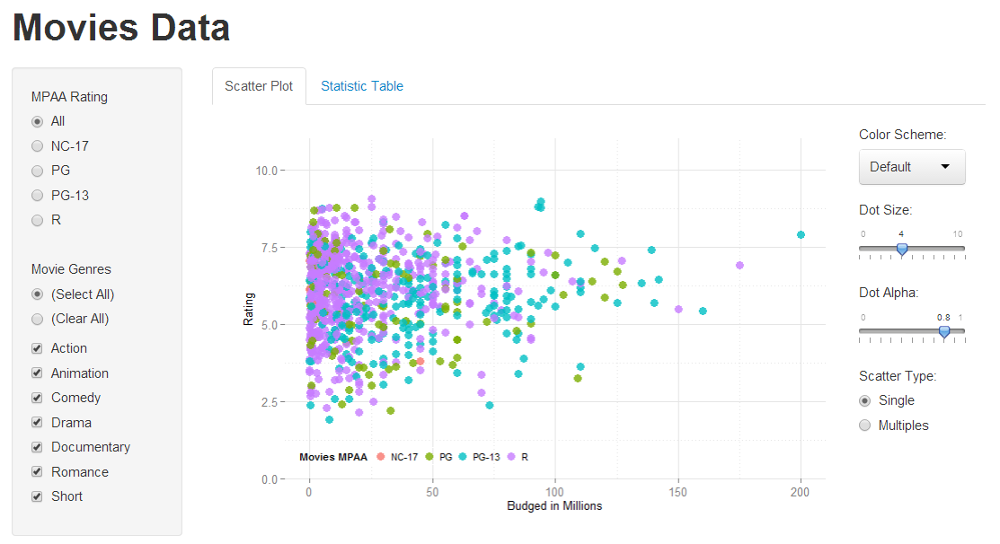
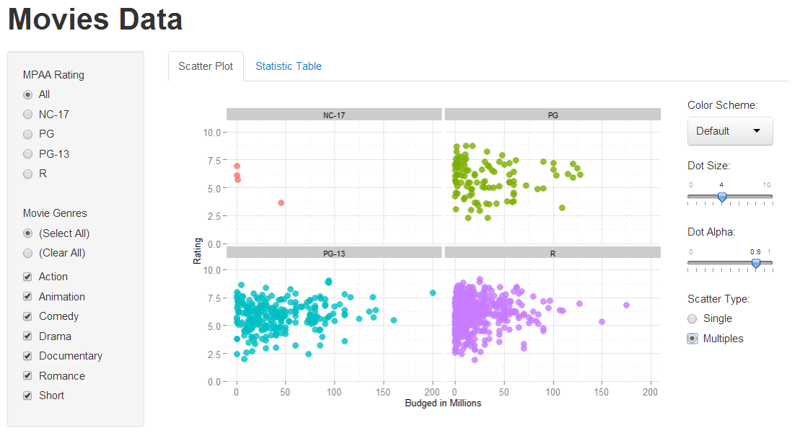
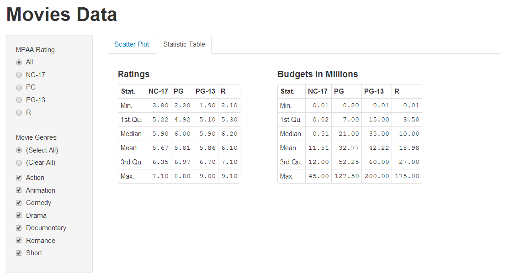

Homework 2: Interactivity
==============================

| **Name**  | Dora (Weiran) Wang  |
|----------:|:-------------|
| **Email** | wwang48@dons.usfca.edu |

## Instructions ##

The following packages must be installed prior to running this code:

- `ggplot2`
- `shiny`
- `scales`

To run this code, please enter the following commands in R:

```
library(shiny)
shiny::runGitHub('msan622', 'doraw880', subdir='homework2')
```

This will start the `shiny` app. See below for details on how to interact with the visualization.

## Discussion ##

### Basic Scatterplot ###

The basic scatterplot shows the scatterplot of IMDB ratings versus movie budgets. Users could filter which MPAA ratings and which movie genres to view (select on the left side). They can also change color schemes, dot size and dot transparency of the plot (adjust on the right side).



### Details ###

- Added "(Select All)" and "(Clear All)" options in the Movie Genres so that users can easily select all the genres or clear all the genres. It is more convenient for them especially when they want to reselect the options.
- Put the filtered dots on the front of grey dots so that users can clearly see the dots they filtered.
- Adjusted positions of color select box, dot size and dot alpha sliders to the right of the plot. Therefore, all the controls and image stay in one screen, and users do not need to roll down to choose the options. Besides, when users click the second tab, these controls which only relevant to the scatter plot will not appear on the screen.

### Customization ###

#### Multiple Scatterplots ####

When users choose the "Multiples" option in the "Scatter Type", it shows the multiple scatterplots grouped by mpaa ratings. In this way, users could see the scatter of each mpaa rating, and compare the distributions more easily. For example, as shown in the multiple plots below, when all the genres are included, though the number of movies rated R is larger than that of movies rated PG-13, the variance of budget is smaller.



#### Statistic Tables ####

If users want to see more detailed statistics of movie ratings and movie budgets in each mpaa rating, they can click "Statistic Table" tab. The tables include maximum, minimum, mean, median, 1st quantity and 3rd quantity of the data filtered by the genres. Users may find interesting things from these statistics. As shown in the tables below, if all the genres are selected, the medians of ratings for all mpaa ratings are close, while the medians of budgets are quite different.


