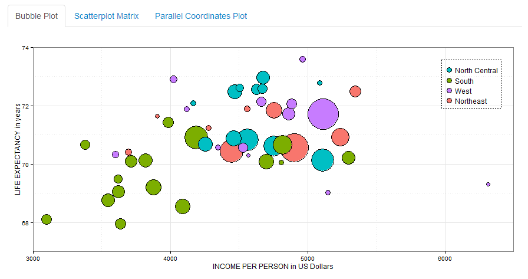
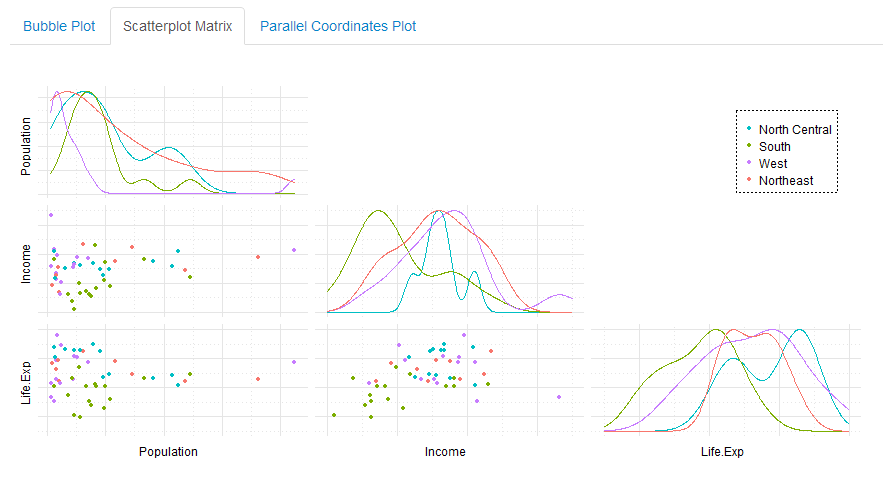
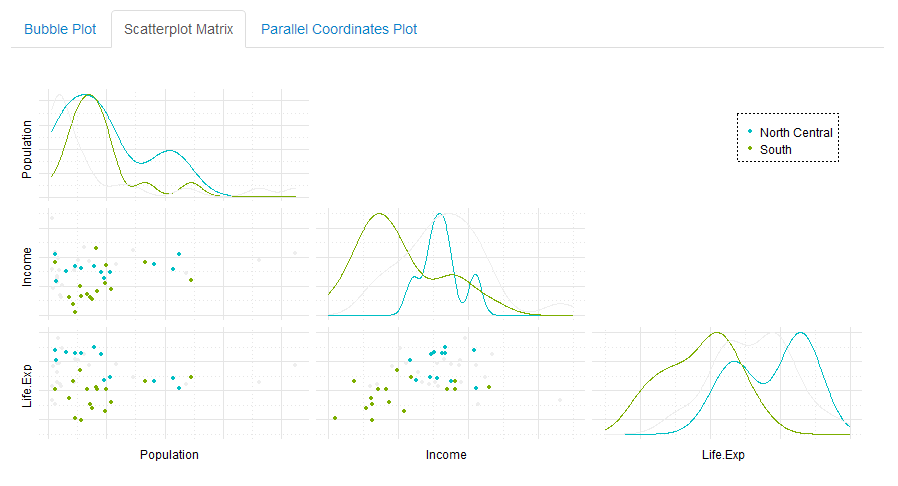
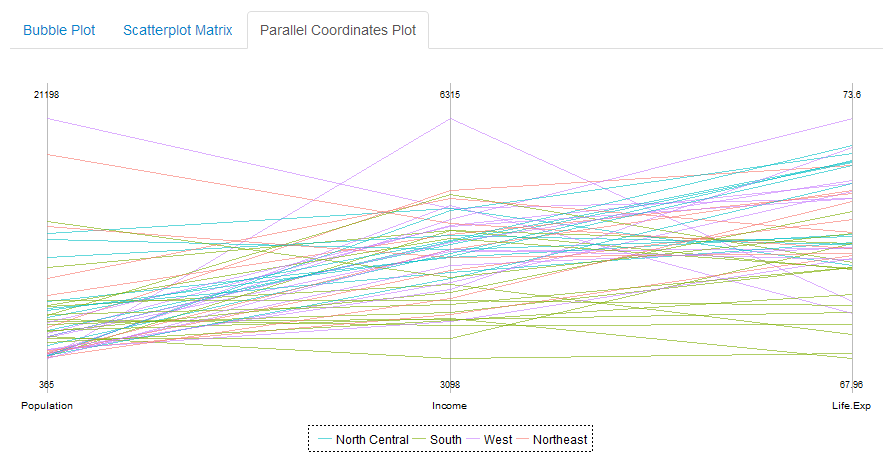
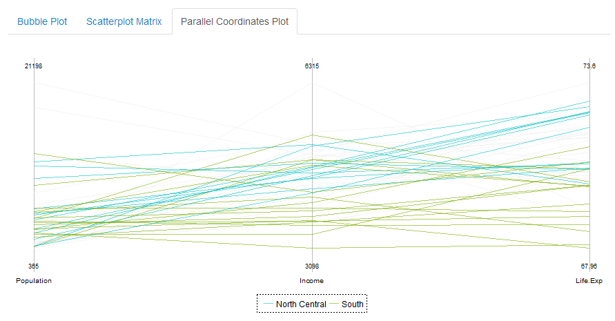
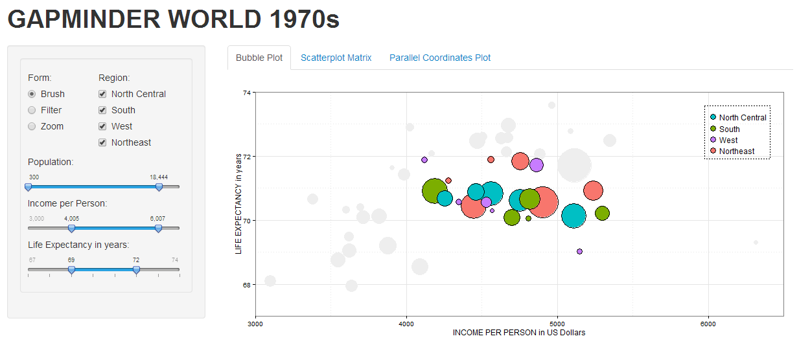
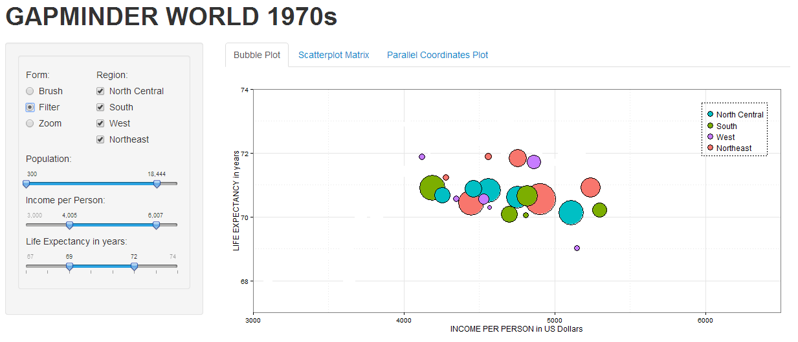
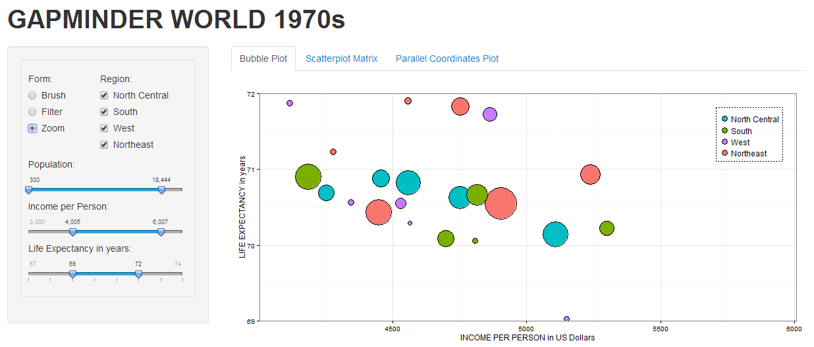

Homework 3: Multivariate
==============================

| **Name**  | Dora Wang  |
|----------:|:-------------|
| **Email** | wwang48@dons.usfca.edu |

## Instructions ##

The following packages must be installed prior to running this code:

- `ggplot2`
- `shiny`
- `scales`
- `reshape2`
- `grid`
- `GGally`

Use the following code to run this shiny app:

```
library(shiny)
shiny::runGitHub('msan622', 'doraw880', subdir='homework2')
```

## Discussion ##

For all the plots, the columns I chose are "Income", "Exp.Life", "Population" and "Region" as I wanted to find the relationship between these factors. To prepare the data set, I added a color column and assigned them the default colors according to "Region". When users filter the data, the color of filtered-out data will be assigned to `#EEEEEE` (if users choose "Brush") or `#FFFFFF` (if users choose "Filter" or "Zoom").

### Technique 1: Bubble Plot ###


Bubble Plot is easy to read, and we could get a big picture from it. I used population as bubbles' size. Therefore, bigger bubble represents the country with larger population. We could see from the plot that the life expectancy and lower income have linear relationship. In general, the countries in South have relatively lower life expectancy and lower income, while those in North Central have relatively higher life expectancy.

To make the plot look good, I removed the color of background, added borders of both the whole plot and the legend. I changed the texts of x-axis and y-axis for easy reading. I also added borders of bubbles so that we could see every bubble more clearly.

### Technique 2: Scatterplot Matrix ###


In a Scatterplot Matrix, we could have a initial understanding on the distributions of the classes in each pair of features. On the diagonal, I plot the density of the feature. On the left and bottom side, I plot the scatterplot for each pair of features. From this plot, we could get a similar conclusion as above that countries in South have lower life expectancy and lower income, while those in North Central have higher life expectancy.



When we only choose region South and region North Central, we could clearly see two clusters here.

For Scatterplot Matrix, I removed the plots on the right and up side which are the same as those in the symmetrical positions. I added a legend for a whole plot. I also removed the color of background and added the border of the legend.

### Technique 3: Parallel Coordinates Plot ###


From the Parallel Coordinates Plot, we could visualize the data with more than 2 dimensions.



### Interactivity ###



