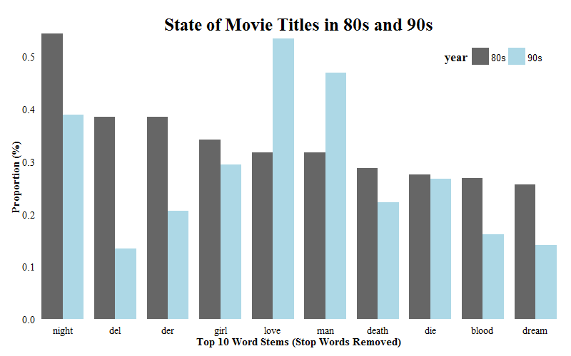
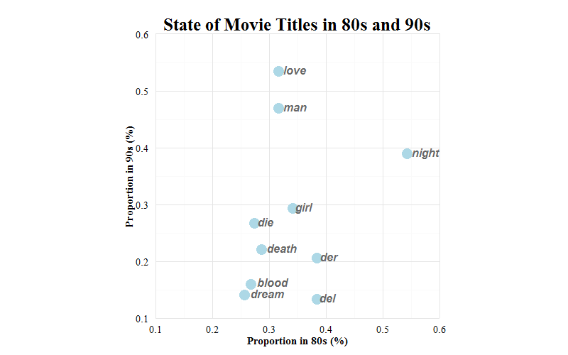
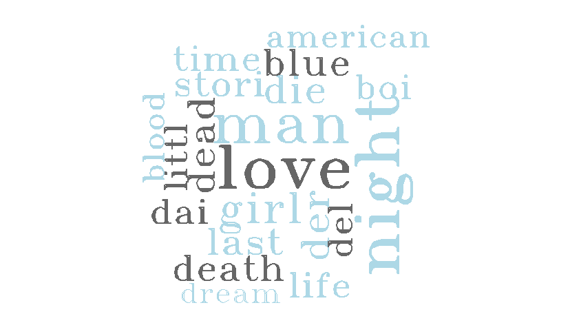

Homework 4: Text Visualization
==============================

| **Name**  | Dora (Weiran) Wang |
|----------:|:-------------|
| **Email** | wwang48@dons.usfca.edu |

## Instructions ##

The following packages must be installed prior to running this code:

- `tm`
- `SnowballC`
- `ggplot2`
- `wordcloud`

To run this code, please enter the following commands in R:

```
source_url("https://github.com/doraw880/msan622/tree/master/homework4/barplot.R")
source_url("https://github.com/doraw880/msan622/tree/master/homework4/freqplot.R")
source_url("https://github.com/doraw880/msan622/tree/master/homework4/wordcloud.R")
```

This will generate 3 images. See below for details.

## Discussion ##

### Data Set ###

I used the `title` column of `movies` data set in `ggplot2` as my dataset. I first selected all the movies in 80s and all the movies in 90s, and aggregated their titles into two txt files. I wanted to analyze what are the most common words in both 80s and 90s, and how their frequencies/proportions changed from 80s to 90s.

I transformed both the data sets as the following steps:
- Converted all the letters to lower cases
- Removed all the punctuation except the intra dashes between words
- Removed English stop words such as "the", "a", etc.
- Transformed all the words to their porter stems
- Stripped white spaces
- Mannually checked other meaningless words such as "will", "can", etc. and removed them from the data sets
- Calculated frequencies for each word
- Converted to a term/frequency format dataframe
- Sorted the dataframe by the frequency
- Calculated proportions for each word using frequencies divided by the total number of words

Finally, I combined two data sets together using `merge` function. The final data set is shown as following.

```
> head(sotu_df)
       word freq80    prop80 freq90    prop90
10362 night     89 0.5421870    102 0.3889418
3702    del     63 0.3837953     35 0.1334604
3788    der     63 0.3837953     54 0.2059104
5830   girl     56 0.3411514     77 0.2936130
8779   love     52 0.3167834    140 0.5338418
9079    man     52 0.3167834    123 0.4690181
```

### Plot 1. Bar Chart ###


I first created a bar chart to compare proportions of top 10 common words in 80s' and 90s' movie titles. I removed the background color, axis ticks and all the panel grid to increase the data-ink ratio. I also put the legend in the right top of the plot to save some space. I made the bin width as 0.8 to increase the data density. The lie factor of this plot is 1 as the height/area of each bar is proportional to the data.

As shown in the bar chart, "night", "del", "der", "blood" and "dream" appear more frequently in 80s' movie titles than 90s', while "love" and "man" are more frequent in 90s' movie titles. The proportion of word "die" didn't change a lot from 80s to 90s.

### Plot 2. Scatter Plot ###


I also created a scatter plot to compare proportions of top 10 common words in 80s' and 90s' movie titles. I removed the background color, axis ticks and all the panel grid to increase the data-ink ratio. I made the dot size as 5 to increase the data density. The x-axis and y-axis are in the same scale, so the lie factor of this plot is also 1. I also adjusted the position of word texts to the right of the dots for easier reading.

As shown in the scatter plot, "love" and "man" appear frequently in 90s' movie titles, while "night" appears frequently in 80s' movie titles, which is consistent with bar chart.

### Plot 3. Word Cloud ###


I created word cloud to show the most common words in 80s and 90s' movie titles. Bigger word means higher frequency. I changed the family font and color for the words to keep the consistency with other plots. However, in this way, the words in grey colors catch more attention than those in light blue colors, which will mislead viewers. Besides, word with more letters look bigger than that with fewer letters, which will also mislead viewers. Therefore, the lie factor of this plot is not close to one.

To make the 3 images consistent, I chose `grey40` and `light blue` as the only two main colors. All titles, axis labels and axis texts in the 3 images are changed to "serif" family font.

