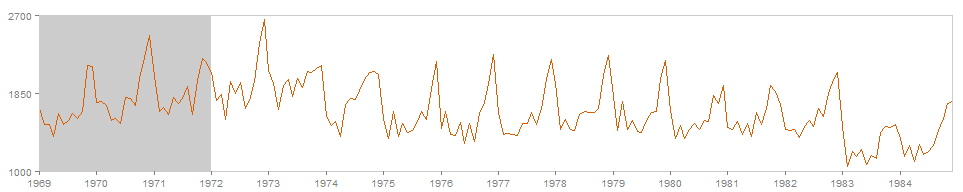
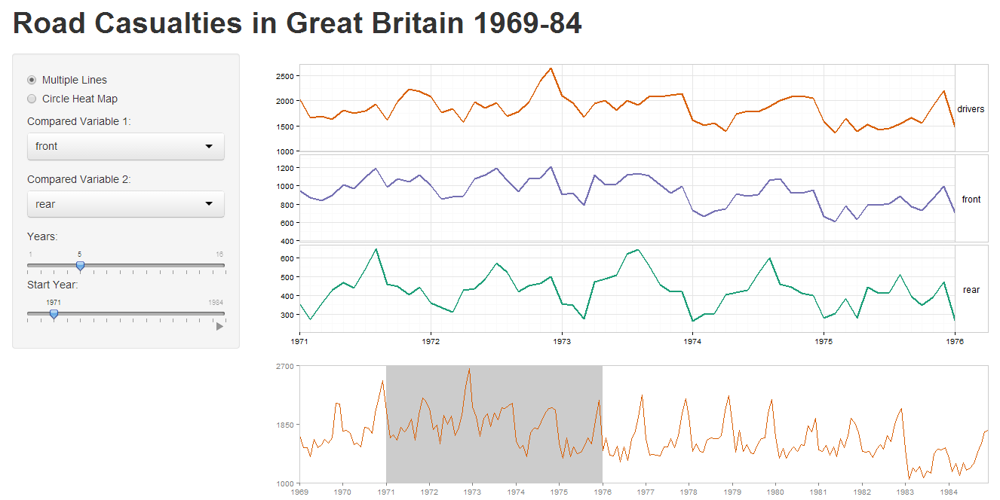
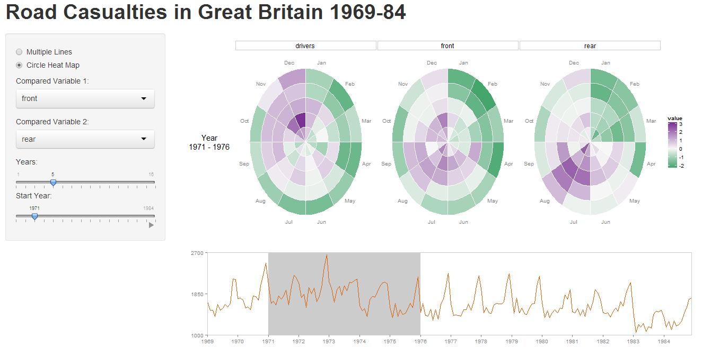

Homework 5: Time Series Visualization
==============================

| **Name**  | Dora (Weiran) Wang  |
|----------:|:-------------|
| **Email** | wwang48@dons.usfca.edu |

## Instructions ##

The following packages must be installed prior to running this code:

- `ggplot2`
- `shiny`
- `reshape`
- `scales`

Use the following code to run this shiny app:

To run this code, please enter the following commands in R:

```
library(shiny)
shiny::runGitHub('msan622', 'doraw880', subdir='homework5')
```

## Discussion ##

The data source of this shiny app is `UKDriverDeaths`, which is a time series giving the monthly totals of car drivers in Great Britain killed or seriously injured Jan 1969 to Dec 1984. The goal of this shiny app is to enable users to select variables and compare them to the number of car drivers killed or seriously injured, in order to find the relationship between them.

### Interactivity ###

- User can choose "Multiple Lines" or "Circle Heat Map" to view.
- The default variable is "drivers". User can choose two other variables to compare them with "drivers".
- User can choose how many years to view. The maximum number of years user can choose is 16 which is the total year range of the dataset.
- User can choose which start year to view.
- User can click the play button to view the animated plot.

### Plot 0. Overview ###



The overview plot is the time series line plot of the monthly number of car drivers killed or seriously injured in the entire 16 years (from 1969 to 1984). The grey area is according to the start year and number of years that user chooses.  The multiple lines or heatmap circle view is an enlarged and detailed graph of this grey area. I chose red as the line color because people are injured or killed and red reprensents "blood" and "deaths".

### Plot 1. Multiple Lines ###



In the mutliple lines, we can clearly see the trends of three variables and figure out whether the variables are correlated or not. 

For this plot, I added `facet_grid` to seperate the lines into three plots as the y-axis are different for three variables and the seperated plots are more easily to compare since lines won't cross with each other. I removed the background color and added line size to increase the data-ink ratio. I set every month as minor vertical panels and set every year as major vertical panels. I manually set the color of three lines and keep the color of "driver" line as red which is consistent with the color in the overview plot. For the `strip` of `facet_grid`, I removed the background color, changed the border color as grey and adjusted the size and angle of text for easy viewing.

### Plot 2. Heatmap Circle View ###



In the heatmap circle view, we can clearly see the seasonality and how data in the same month changes in different years.

For this plot, I added month and year to the dataset, used `melt` and `ddply` to transform data and used transformed data to plot circle view. I also added `facet_grid` to seperate the heatmap for each variable. I removed the background color, panels and axis ticks to increase the data-ink ratio. I chose "purple" as the color of high value and "green" as the color of low value as these two constrast colors look the nicest. For the `strip` of `facet_grid`, I removed the background color, changed the border color as grey and adjusted the size and angle of text for easy viewing. I also added the y-axis title and made it changeable according to the selected years.

I set 3000 milliseconds between each animation step because the loading time for circle heat map is slow. However, if the chosen number of years is above 5, even 3000 milliseconds may not enough for loading. In this case, I think animation may be inapproriate. 
