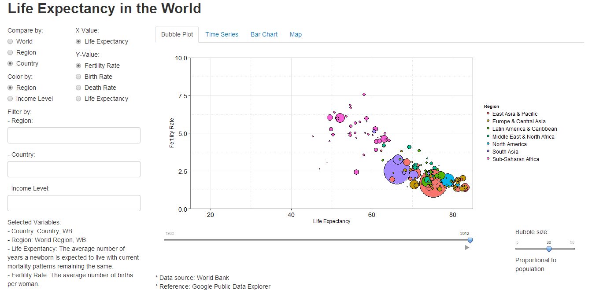

Project: Prototype
==============================

| **Name**  | Dora (Weiran) Wang  |
|----------:|:-------------|
| **Email** | wwang48@dons.usfca.edu |

## Instructions ##

The following packages must be installed prior to running this code:

- `ggplot2`
- `shiny`
- `grid`

Use the following code to run this shiny app:

To run this code, please enter the following commands in R:

```
library(shiny)
shiny::runGitHub('msan622', 'doraw880', subdir='project-prototype')
```


## Discussion ##

### Dataset ###

The datasets are all from World Bank. I downloaded 5 data sets from the website and combined them to a single data set. The final cleaned data is shown as follows.

```
> head(combined.data)
  Country.Code                    Region          IncomeGroup Country.Name year Birth.Rate Death.Rate Fertility.Rate    Life.Exp Population
1          ABW Latin America & Caribbean High income: nonOECD        Aruba 1980     22.473      6.376          2.392 72.22014634      60096
2          ABW Latin America & Caribbean High income: nonOECD        Aruba 1981     22.424      6.445          2.377 72.46234146      60567
3          ABW Latin America & Caribbean High income: nonOECD        Aruba 1982      22.33      6.519          2.364 72.67319512      61344
4          ABW Latin America & Caribbean High income: nonOECD        Aruba 1983     22.188      6.603          2.353 72.84902439      62204
5          ABW Latin America & Caribbean High income: nonOECD        Aruba 1984     21.989      6.694          2.342  72.9897561      62831
6          ABW Latin America & Caribbean High income: nonOECD        Aruba 1985     21.727      6.786          2.332 73.09797561      63028
```

### Screenshot ###



### Prototype ###

The prototype is a bubble plot of Fertility Rate vs. Life Expectancy. The bubble size is propotional to population, and color is grouped by region. To make the plot look good, I removed the color of background, added border to the whole plot. I also added borders of bubbles and put small bubbles on the front so that we could see every bubble more clearly.

From the plot we could see a negative correlation between Fertility Rate and Life Expectancy, indicating that people tend to live longer when women have fewer children.

### Interface ###

- Users can choose which level to compare. If they choose "Region", the data will be calculated in a region level, and each bubble, for example in the bubble plot, will represent each region instead of each country.
- Users can choose by which variable the plot is colored .
- Users can chosse which Y-value to view.
- Users can filter Region, Country and Income Level to view.
_ In each plot, there are also one or two different interfaces. For example, in the bubble plot, users can select which year to view or click the play button to watch an animated plot. They can also adjust the bubble size.
