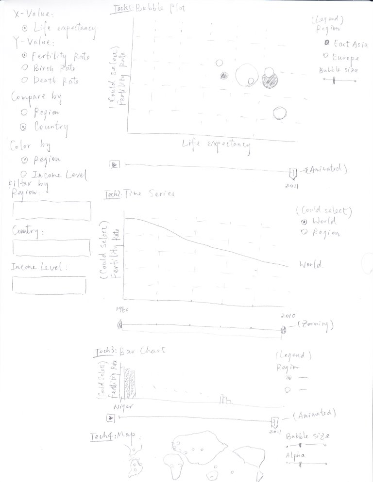

Project: Sketch
==============================

| **Name**  | Dora (Weiran) Wang  |
|----------:|:-------------|
| **Email** | wwang48@dons.usfca.edu |

## Discussion ##

### Planned Tools ###

- `R`
- `ggplog2`
- `shiny`

### Planned Techniques ###

#### Tech 1. Bubble Plot ####

Each bubble represent each country, I plan to fix x-axis as Life Expectancy, and make y-axis choosable. The size of bubbles is determined by population, and the color is determined by regions. In this way, bubble plot could give a big picture of the relationship between Life Expectancy and different variables. The bubbles could move by different years so that we could see the trend of Life Expectancy and variables in different countries during these years.

#### Tech 2. Time Series ####

Time series could show how the values change during these years. For example, how does Life Expectancy change at a global level? How does it change at a region level? Are the decrease/increase rates the same in different regions?

#### Tech 3. Bar Chart ####

I planned to create a sorted bar chart. Users could choose by which variable they want to sort. The x-axis should be the names of countries, and the color of each chart is determined by regions. In this way, we could see which country has the highest/lowest value, and which region has more higher/lower values.

#### Tech 4. Map ####

The map could give a geographic picture. We could see how values differ between neighbors. The colors' gradients here are determined by the values.

### Planned Interaction ###

Users could choose varible for all four techniques. Region,  and year range could be filtered.
For Tech 1. Bubble Plot, animation by years and zooming by x and y values would be applied.
For Tech 2. Time Series, zooming by years would be applied.
For Tech 3. Bar Chart, sorting by y-value, zooming by x-value would be applied.
For Tech 4. Map, zooming by region, filtering by values would be applied.

### Planned Interface ###

